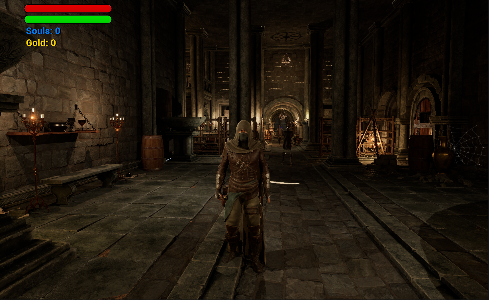
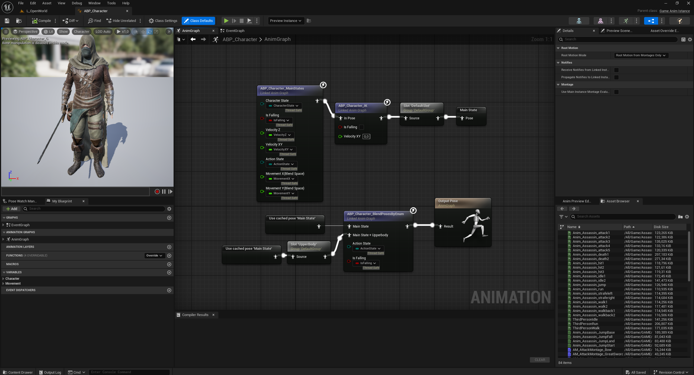
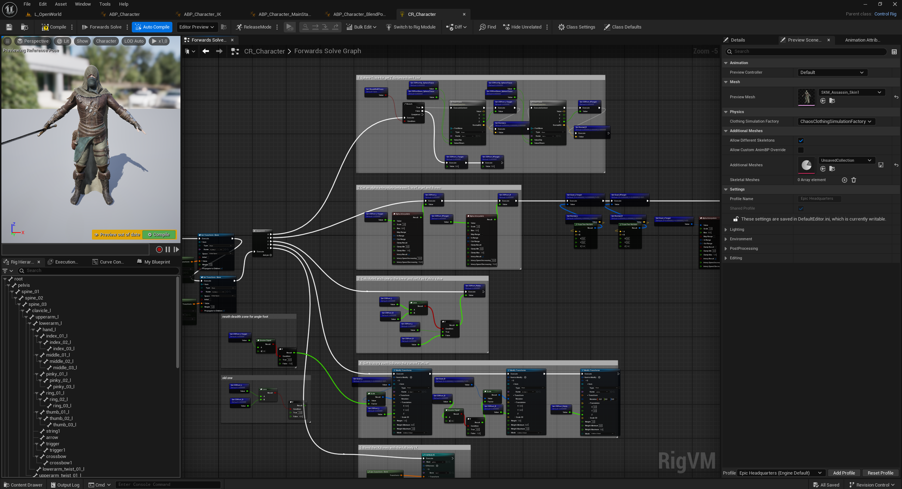
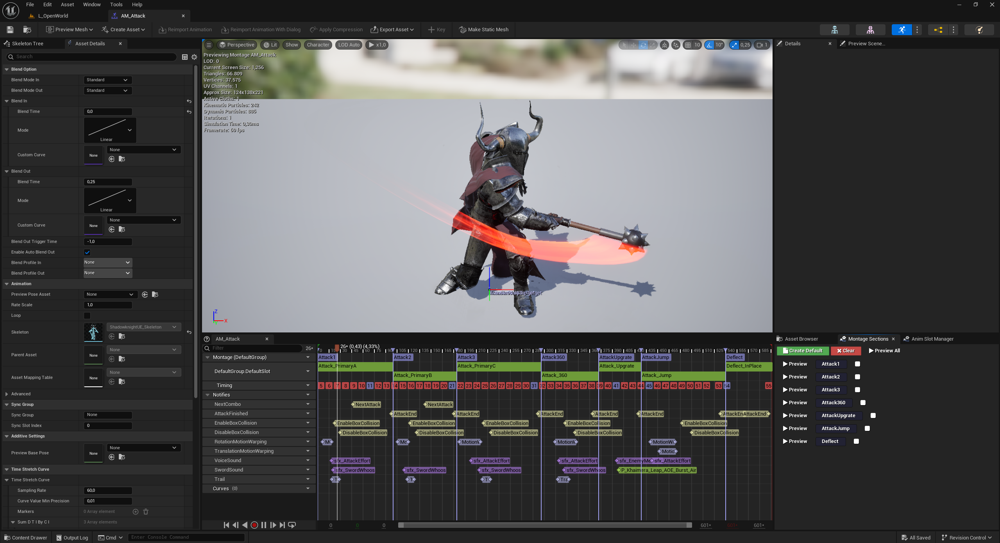

# Golden Souls

**Click on the image below to watch the trailer for Golden Souls!**

---

## Project Description

Golden Souls is a third-person action RPG inspired by the Souls-like genre.  
Set in a dark fantasy world, players explore cursed dungeons, wield a variety of melee weapons, and battle monstrous enemies to survive.

This is a personal project I created to learn how to develop one of my favorite game genres.  
It was built using Unreal Engine 5 and C++, combining structured learning from a Udemy course with custom implementations such as a bow system and the UEnemySmartAttack component for advanced enemy behaviors.

---

## What I Learned

- Building an open world using Landscape and Foliage tools  
- Creating realistic environments with Quixel Megascans  
- Developing melee combat systems with swords and root motion via Motion Warping  
- Implementing health bars, player stats, and enemy AI  
- Using Packed Level Instances to import dungeon levels into the open world  
- Designing multiple enemy types: humanoids, monsters, and creatures  
- Working with Niagara for particle effects (blood splatter, weapon trails)  
- Integrating MetaSounds for dynamic and high-quality audio  
- Applying clean coding practices in C++ with data structures and design patterns  
- Creating complex Animation Blueprints, retargeting, and Control Rig setups with inverse kinematics  
- Debugging and refactoring for performance and scalability

---

## Screenshots

  
  

---

